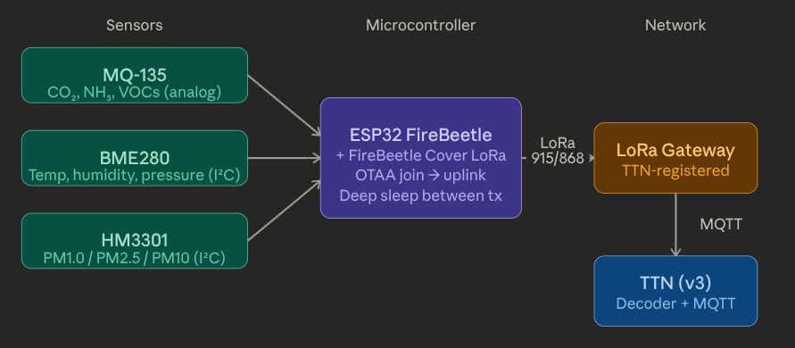

Introduction

This repository contains the hardware implementation of the Air Quality Monitoring System, designed to measure environmental and air pollution parameters in real time and transmit the data to The Things Network (TTN) using LoRaWAN communication.

The system is built around the ESP32 FireBeetle microcontroller integrated with a LoRa module, forming a low-power wireless sensor node. The node collects data from multiple environmental sensors, processes it, and sends compact payloads over a LoRa gateway to the cloud for storage, visualization, and further analysis.

Sensors Used

The hardware node integrates the following sensors to capture a wide range of environmental and air quality parameters:

MQ-135 Gas Sensor
Used to estimate air pollutants such as ammonia (NH₃), nitrogen oxides (NOₓ), alcohol, benzene, smoke, and carbon dioxide (CO₂). It provides an analog output that represents overall air quality levels. The firmware converts the sensor resistance to approximate ppm values using datasheet curves.

BME280 Environmental Sensor
A digital sensor that measures temperature, humidity, and atmospheric pressure with high accuracy using I2C communication.

HM3301 Laser Dust Sensor
A particulate matter sensor that measures air quality based on particle concentration, including PM1.0, PM2.5, and PM10, which are critical indicators of air pollution.

Firmware Behavior (Current)

The firmware in [main/main.cpp](main/main.cpp) reads all sensors and prints the data to the Serial Monitor every 5 seconds.

- BME280: temperature (degC), humidity (%), pressure (hPa), altitude (m)
- HM3301: PM1.0 / PM2.5 / PM10 (standard and atmospheric ug/m3)
- MQ-135: ADC raw, voltage, Rs, Rs/Ro, estimated ppm for CO2, NOx, VOC, and Alcohol

Wiring and Pin Mapping

- ESP32 I2C: SDA = GPIO21, SCL = GPIO22
- MQ-135 analog: GPIO34 (input-only ADC)
- HM3301: I2C on the same bus as BME280

The firmware tries BME280 at I2C address 0x76 first, then 0x77. The HM3301 default address is 0x40.

MQ-135 Calibration (Important)

The MQ-135 requires 24-48 hours of warm-up for stable readings. After warm-up in clean air, uncomment the calibration block in [main/main.cpp](main/main.cpp) to measure Ro and copy the value into `MQ135_RZERO`.

Build and Monitor

This project uses PlatformIO.

1. Build and upload:
	- `pio run -t upload`
2. Serial monitor:
	- `pio device monitor -b 115200`

Data Transmission

After collecting data from the sensors, the ESP32 encodes the readings into a compact payload and transmits them via LoRaWAN to a nearby gateway. The gateway forwards the data to The Things Network, where it can be decoded, visualized, and integrated with backend systems such as APIs or dashboards.

