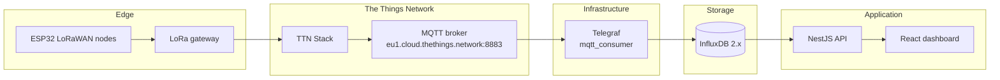

# Infrastructure — Telemetry Pipeline

This folder contains the **data-ingestion layer** for the Air Quality Monitoring System. It runs [Telegraf](https://www.influxdata.com/time-series-platform/telegraf/) as a bridge between **The Things Network (TTN)** MQTT uplinks and **InfluxDB 2.x**, where sensor readings are stored for the NestJS API and React dashboard.

Hardware nodes are described in [`../IOT/README.md`](../IOT/README.md). The application stack (API, frontend, PostgreSQL) is documented in [`../software/README.md`](../software/README.md).

---

## Table of contents

- [Role in the system](#role-in-the-system)
- [Architecture](#architecture)
- [Repository contents](#repository-contents)
- [Prerequisites](#prerequisites)
- [Configuration](#configuration)
- [Expected data shape](#expected-data-shape)
- [Running Telegraf](#running-telegraf)
- [Verifying the pipeline](#verifying-the-pipeline)
- [Connecting the backend](#connecting-the-backend)
- [Troubleshooting](#troubleshooting)
- [Security notes](#security-notes)

---

## Role in the system

LoRaWAN sensor nodes transmit compact payloads to TTN. TTN decodes each uplink and publishes JSON to its MQTT broker. Telegraf subscribes to those topics, normalizes the decoded measurements, and writes time-series points into InfluxDB.

The backend does **not** talk to TTN or MQTT directly — it queries InfluxDB using the `INFLUX_*` environment variables described in the [software README](../software/README.md#environment-variables).

---

## Architecture



**End-to-end path**

1. Sensors collect PM2.5, PM10, temperature, humidity, pressure, and related metrics.
2. Firmware uplinks over LoRaWAN to TTN (see [`../IOT/`](../IOT/)).
3. A TTN **payload formatter** produces a `measurements` array in the decoded payload.
4. Telegraf consumes MQTT uplink messages and writes points to InfluxDB.
5. The API reads readings by Influx **`topic`** tag (the full MQTT topic path), which acts as the sensor identifier across the platform.

---

## Repository contents

```
Infrastructure/
├── README.md        # This file
├── telegraf.conf    # Telegraf agent configuration
└── telegraf.exe     # Windows Telegraf binary (local runtime)
```

| File | Purpose |
|------|---------|
| `telegraf.conf` | Agent settings plus active **MQTT input** and **InfluxDB output** plugins. Most of the file is the upstream Telegraf template; only the uncommented `[[...]]` blocks at the bottom are in use. |
| `telegraf.exe` | Pre-built Telegraf binary for Windows. On Linux or macOS, install Telegraf from [InfluxData downloads](https://portal.influxdata.com/downloads/) and point it at the same config file. |

---

## Prerequisites

Before running the pipeline, ensure you have:

| Requirement | Notes |
|-------------|-------|
| **InfluxDB 2.x** | A running instance with an organization, bucket, and API token that can write data. |
| **TTN application** | LoRaWAN devices registered under a TTN (or TTS) application with an MQTT API key. |
| **Payload formatter** | TTN must decode uplinks into JSON with a `measurements` array (see [Expected data shape](#expected-data-shape)). |
| **TLS CA certificate** | TTN MQTT uses TLS on port `8883`. The config references a CA bundle (e.g. ISRG Root X1). On Windows this is often installed with [Eclipse Mosquitto](https://mosquitto.org/download/); adjust the path in `telegraf.conf` for your OS. |
| **Network access** | Outbound HTTPS/MQTTS to `eu1.cloud.thethings.network` (or your TTN cluster) and to your InfluxDB URL. |

---

## Configuration

The active plugins in `telegraf.conf` are:

### Input — `[[inputs.mqtt_consumer]]`

Subscribes to TTN device uplinks over MQTTS and parses JSON with the `json_v2` parser.

| Setting | Description |
|---------|-------------|
| `servers` | TTN MQTT endpoint, e.g. `ssl://eu1.cloud.thethings.network:8883` |
| `username` | TTN application ID, e.g. `your-app@ttn` |
| `password` | TTN MQTT API key (generated in the TTN console) |
| `topics` | Uplink wildcard, e.g. `v3/your-app@ttn/devices/+/up` |
| `tls_ca` | Path to the CA certificate file used to verify the broker |
| `data_format` | `json_v2` |
| `path` | `uplink_message.decoded_payload.measurements` — array of `{ name, value, unit? }` objects |

Telegraf automatically adds an MQTT **`topic`** tag (the full topic string). The backend uses this tag as the sensor ID when listing devices and serving readings.

### Output — `[[outputs.influxdb_v2]]`

Writes parsed metrics to InfluxDB 2.x.

| Setting | Description |
|---------|-------------|
| `urls` | InfluxDB base URL, e.g. `http://localhost:8086` or your remote host |
| `token` | InfluxDB API token with write access to the target bucket |
| `organization` | InfluxDB organization name |
| `bucket` | Destination bucket for sensor readings |

### Output — `[[outputs.file]]` (debug)

Mirrors metrics to **stdout** in Influx line protocol. Useful when validating parsing before checking InfluxDB. Remove or comment out this block in production if you do not need console output.

### Agent tuning

The `[agent]` section sets a **1 s** collection interval and **2 s** flush interval, with `omit_hostname = true` so points are not tagged with the Telegraf host name.

### Using environment variables

Telegraf supports `${VAR}` substitution in the config file. Prefer this over hard-coding secrets:

```toml
[[outputs.influxdb_v2]]
  urls = ["${INFLUX_URL}"]
  token = "${INFLUX_TOKEN}"
  organization = "${INFLUX_ORG}"
  bucket = "${INFLUX_BUCKET}"

[[inputs.mqtt_consumer]]
  username = "${TTN_APP_ID}"
  password = "${TTN_MQTT_API_KEY}"
```

Set the variables in your shell or a local `.env` file that is **not** committed to git.

---

## Expected data shape

### TTN decoded payload

Each MQTT message should contain an uplink whose decoded payload includes a measurements array:

```json
{
  "uplink_message": {
    "decoded_payload": {
      "measurements": [
        { "name": "PM2.5", "value": 12.4, "unit": "µg/m³" },
        { "name": "PM10", "value": 18.1, "unit": "µg/m³" },
        { "name": "Temperature", "value": 28.3, "unit": "°C" },
        { "name": "Humidity", "value": 65.0, "unit": "%" }
      ]
    }
  }
}
```

The `name` field becomes an Influx **tag**; `value` and `unit` are written as **fields**.

### InfluxDB schema (as consumed by the API)

The NestJS `InfluxService` expects:

| Element | Value |
|---------|-------|
| Measurement | `air_quality` |
| Tag `topic` | Full MQTT topic, e.g. `v3/your-app@ttn/devices/my-sensor-node/up` |
| Tag `name` | Metric name, e.g. `PM2.5`, `Temperature` |
| Field `value` | Numeric (or string) reading |
| Field `unit` | Optional unit string (skipped by the API when building readings) |

Sensor registration and map labels in the admin UI key off the exact **`topic`** string. When registering a sensor in **Admin → Sensor Management**, use the Influx topic value verbatim.

---

## Running Telegraf

From this directory on **Windows**:

```powershell
cd Infrastructure
.\telegraf.exe --config telegraf.conf
```

On **Linux / macOS** (after installing the `telegraf` binary):

```bash
cd Infrastructure
telegraf --config telegraf.conf
```

Run in the foreground while debugging; use a process manager (systemd, NSSM, Windows Service) for production.

---

## Verifying the pipeline

### 1. Dry-run the config (no writes)

```powershell
.\telegraf.exe --config telegraf.conf --test
```

You should see parsed `air_quality` metrics with `topic` and `name` tags in the output.

### 2. Confirm MQTT connectivity

- Ensure at least one TTN device has sent an uplink recently.
- Check that the MQTT API key has **Subscribe** rights for the application.
- Verify the `topics` pattern matches your application ID.

### 3. Confirm InfluxDB writes

In the InfluxDB UI (**Data Explorer**), run a query similar to:

```flux
from(bucket: "mybucket")
  |> range(start: -1h)
  |> filter(fn: (r) => r._measurement == "air_quality")
  |> limit(n: 20)
```

Replace `mybucket` with your configured bucket name.

### 4. Confirm the API sees data

With the backend running and `INFLUX_*` variables set to the same org/bucket/token:

```http
GET /api/health
GET /api/readings?hours=24
```

See the [software README](../software/README.md) for full API and environment setup.

---

## Connecting the backend

Point the NestJS backend at the **same** InfluxDB instance Telegraf writes to:

```env
INFLUX_URL=https://your-influx-host:8086
INFLUX_TOKEN=your-read-write-or-read-token
INFLUX_ORG=your-org
INFLUX_BUCKET=your-bucket
```

The API reads live time-series data from InfluxDB; user accounts, sensor registry, and privacy rules remain in PostgreSQL.

---

## Troubleshooting

| Symptom | Things to check |
|---------|-----------------|
| **No MQTT messages** | Device joined and sending on TTN; topic pattern matches `v3/<app-id>@ttn/devices/+/up`; API key valid; firewall allows outbound `8883`. |
| **TLS / certificate errors** | `tls_ca` path exists and points to a trusted root CA; try Mosquitto's `isrgrootx1.pem` or your OS trust store. |
| **Metrics parse but fields are empty** | TTN payload formatter output must match `uplink_message.decoded_payload.measurements`; inspect a raw uplink in the TTN console. |
| **Influx write failures** | URL reachable; token has write permission; org and bucket names match exactly. |
| **API shows no sensors** | Readings must include a non-empty `topic` tag and a `value` field; query Influx directly first. |
| **Wrong sensor on map / duplicate IDs** | Each physical device should publish on a distinct MQTT topic; register sensors using the full topic string. |

For application-level issues (empty charts, privacy, rate limits), see [Troubleshooting](../software/README.md#troubleshooting) in the software README.

---

## Security notes

- **Do not commit secrets.** `telegraf.conf` may contain Influx tokens and TTN API keys — treat it like `.env` and keep credentials out of version control, or use environment-variable substitution.
- **Rotate compromised keys** immediately in both TTN and InfluxDB if credentials were exposed.
- **Restrict InfluxDB tokens** to the minimum scope (write-only for Telegraf; read-only for the API if possible).
- **Use TLS** for both MQTT (`8883`) and InfluxDB in production.
- Consider adding `telegraf.exe` to `.gitignore` and downloading the binary per machine instead of storing it in the repo.

---

## Related documentation

- [`../README.md`](../README.md) — project overview  
- [`../IOT/README.md`](../IOT/README.md) — sensor hardware and firmware  
- [`../software/README.md`](../software/README.md) — API, frontend, Docker, and Influx query endpoints
