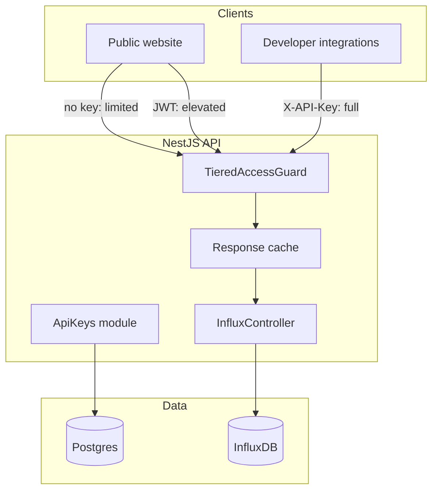

# Air Quality Intelligence Platform — Unified Plan

## Vision

Transform the existing Air Quality Monitoring app into a modern **Environmental Intelligence Platform** that combines public transparency, real-time monitoring, a developer API ecosystem, and role-based operational dashboards.

**Product feel:** Stripe / Linear / Vercel / Plausible — not a traditional government dashboard.

**Principles:** Apple-level simplicity, Linear-level navigation, Stripe-level dashboard quality, high trust, fast loading, mobile-first, accessibility-first.

**Avoid:** Dashboard clutter, excessive cards, AQI badges everywhere, random colors, dense admin tables, legacy enterprise UI.

---

## Current state

- **Backend:** NestJS + Prisma/Postgres + InfluxDB. JWT auth with roles `USER`, `ADMIN`, `OWNER`.
- **Frontend:** Vite/React + Tailwind v4. Public home at `/`, analytics at `/user-dashboard`, admin at `/admin`.
- **Gaps:** No API key lifecycle, readings fully public, no caching, placeholder admin tabs, header-only nav, inconsistent styling (`LocationDetails` vs design tokens), OWNER role UI mismatch.

---

## Target architecture



### Tiered API access

| Caller | Auth | Rate limit | History | Row limit |
|--------|------|------------|---------|-----------|
| Public | None | 30 req/min | 24h | 100 |
| Authenticated (JWT) | Bearer | 60 req/min | 7d | 500 |
| API key | `X-API-Key` | 300 req/min | 30d | 5000 |

`/api/health` stays public. Key management endpoints require JWT. Server-side param clamping — never trust client limits.

### API key lifecycle

```
User registers → Requests API access → Admin reviews → Approved → Key generated (shown once) → User uses API → Admin/user can revoke
```

- Store `keyHash` + `keyPrefix` only (format: `aqm_<random32>`)
- Statuses: `ACTIVE`, `REVOKED`, `EXPIRED`
- Log all actions to `ActivityLog`
- Prevent duplicate pending requests per user

---

## Design system

### Theme (default: dark)

| Token | Value |
|-------|-------|
| Background | zinc-950 |
| Surface | zinc-900 |
| Borders | zinc-800 |
| Primary | emerald |
| Danger / Warning / Info | red / amber / blue |
| AQI colors | green, yellow, orange, red — **only on AQI elements** |

Extend existing tokens in [`frontend/src/index.css`](frontend/src/index.css). Add light mode toggle later via theme switcher.

### Layout shift: header → sidebar

Replace header-only nav with a **collapsible sidebar** (desktop: 260px expanded / 72px collapsed) + slim top bar (search, notifications, user menu, theme switcher).

**Sidebar navigation (lucide-react icons):**

| Item | Route | Roles |
|------|-------|-------|
| Overview | `/` | All |
| Analytics | `/user-dashboard` | Authenticated |
| Live Map | `/map` | All |
| Sensors | `/sensor-status` | Admin |
| API Access | `/api-access` | Authenticated |
| Documentation | `/api-docs` | All |
| Reports | `/download` | Authenticated |
| Settings | `/profile` | Authenticated |
| Users | `/admin` (users tab) | Admin, Owner |
| API Requests | `/admin` (requests tab) | Admin, Owner |
| API Keys | `/admin` (keys tab) | Admin, Owner |
| System Health | `/admin` (system tab) | Admin, Owner |
| Audit Logs | `/admin` (activity tab) | Admin, Owner |
| Infrastructure | `/private-sensors` | Owner |

Refactor [`AppShell`](frontend/src/app/components/layout/AppShell.jsx) to sidebar layout. Keep [`Header`](frontend/src/app/components/Header.jsx) as top bar only.

### Data visualization

- **Recharts** — line, area, bar charts only (no pie charts)
- AQI trends are the primary visual focus
- Consistent `AqiBadge` component; limit badge usage to data contexts

---

## Phase 1 — Backend foundation

### 1.1 Prisma models

Extend [`backend/prisma/schema.prisma`](backend/prisma/schema.prisma):

- `ApiKeyRequest` — userId, purpose, status (`PENDING`/`APPROVED`/`REJECTED`), reviewer, reviewNote, timestamps
- `ApiKey` — userId, requestId, keyPrefix, keyHash, label, status, lastUsedAt, expiresAt (90-day default), revokedAt/revokedBy

### 1.2 ApiKeys module

Repurpose dead [`backend/src/api/`](backend/src/api/) → `backend/src/api-keys/`. Register in [`app.module.ts`](backend/src/app.module.ts).

| Method | Path | Auth | Action |
|--------|------|------|--------|
| POST | `/api/api-keys/requests` | JWT | Submit access request |
| GET | `/api/api-keys/requests/mine` | JWT | Own requests |
| GET | `/api/api-keys/requests` | Admin/Owner | Pending queue |
| POST | `/api/api-keys/requests/:id/approve` | Admin/Owner | Approve, return key once |
| POST | `/api/api-keys/requests/:id/reject` | Admin/Owner | Reject with note |
| GET | `/api/api-keys/mine` | JWT | Own keys (prefix only) |
| POST | `/api/api-keys/:id/revoke` | Owner or Admin | Revoke |

### 1.3 Tiered access guard

On [`influx.controller.ts`](backend/src/influx/influx.controller.ts): resolve tier from `X-API-Key` → JWT → public; enforce limits; update `lastUsedAt` on key use.

### 1.4 Backend caching

`@nestjs/cache-manager`, key: `readings:{tier}:{hours}:{sensorId}:{page}:{limit}`

| Tier | TTL |
|------|-----|
| PUBLIC | 60s |
| AUTHENTICATED | 30s |
| API_KEY | 15s |

Future: Redis for multi-instance.

---

## Phase 2 — Frontend data layer

### 2.1 TanStack Query

Install `@tanstack/react-query`. Wrap app in `QueryClientProvider` in [`main.jsx`](frontend/src/main.jsx).

Shared query key: `['readings', { limit, page, hours, sensorId }]`

| Query | staleTime | Refetch |
|-------|-----------|---------|
| City overview | 60s | 60s background |
| Map | 60s | 60s |
| Analytics | 30s | on focus |
| Admin health | 30s | manual |
| API keys / profile | 5m | on mutation |

Refactor [`useReadings.js`](frontend/src/app/hooks/useReadings.js) → `useReadingsQuery`. Update HomePage, MapPage, DataDashboard, AdminPanel.

**Goal:** navigating between pages reuses cache; no unnecessary refetches.

---

## Phase 3 — API access UI

### 3.1 User: `/api-access` page

- Request form (purpose textarea)
- My requests (status badges)
- My keys (prefix, created, last used, revoke)
- One-time key reveal modal after approval
- Usage widgets: current tier, requests today, rate limits
- Link to [`APIDocumentation.jsx`](frontend/src/app/pages/APIDocumentation.jsx)

New client: `frontend/src/app/lib/api/apiKeys.js`

### 3.2 Admin operations center

Wire [`AdminPanel.jsx`](frontend/src/app/pages/AdminPanel.jsx) tabs:

**Top metrics:** Users, Pending Requests, Active API Keys, Sensors Online, Daily Requests, System Health

**API Request Queue:** actionable cards (not dense tables) — user name, purpose, time ago, Approve/Reject

**API Key Management:** user, prefix, status, created, last used, requests today, Revoke / Inspect User

**Live Activity Feed:** API request submitted, key revoked, sensor offline/online, new registration

**System Health Panel:** API, Database, InfluxDB, Cache, Auth — real-time status pills

Grant **OWNER** access to admin API tabs (fix backend/UI role mismatch).

Replace `alert()`/`confirm()` with `sonner` toasts; mount `<Toaster />` in [`App.jsx`](frontend/src/App.jsx).

---

## Phase 4 — Dashboard redesign

### 4.1 Public homepage (`/`)

City intelligence dashboard:

1. **Hero** — large AQI, city name, dominant pollutant, "Last updated X min ago", "Live Sensor Network" badge
2. **KPI row** (max 5) — AQI, Sensors Online, Cities Covered, Offline Sensors, Active Alerts
3. **AQI trend chart** — largest component; 24h / 7d / 30d toggle (Recharts area chart)
4. **Live map preview** — online/offline sensors, AQI heat zones ([`MapPreview`](frontend/src/app/components/map/MapPreview.jsx))
5. **Sensor grid** — redesigned `LocationCard` (location, AQI, status, last update)
6. **Trust & transparency** — EPA AQI methodology, sensor network, update intervals, open data policy
7. **Education** — accordion ("Learn more"), not long scroll
8. **Role CTA** — USER → Analytics, ADMIN → Admin Center, OWNER → Infrastructure

### 4.2 Authenticated dashboard (`/user-dashboard`)

Role-aware widgets:

- API access status, tier, requests today, rate limits, monthly consumption
- API keys summary + link to `/api-access`
- Recent activity, recent downloads
- Admin/Owner: mini ops stats + link to full admin panel

Post-login: `/dashboard` → role redirect (keep [`RoleRedirect.jsx`](frontend/src/app/routes/RoleRedirect.jsx)).

---

## Phase 5 — Platform UX

### 5.1 Command palette (⌘K / Ctrl+K)

Global search: users, sensors, API keys, locations, reports, settings, navigation actions.

New: `frontend/src/app/components/CommandPalette.jsx`

### 5.2 Notification center

Top bar bell with unread badge. Events: API approved/rejected, key revoked, sensor offline/online, high AQI alert.

Backend: start with polling; future WebSocket/SSE.

### 5.3 UI consistency pass

| Issue | Fix |
|-------|-----|
| `LocationDetails.jsx` raw gray classes | Migrate to design tokens |
| Dead `AQICard.jsx` | Remove |
| `ProtectedRoutes` plain loading | `LoadingBlock` skeleton |
| Auth blank screen | AppShell skeleton during init |
| Unused MUI/Radix deps | Remove from package.json |

### 5.4 Trust, accuracy, security

- Data freshness on every readings view
- Offline sensor detection ([`sensorStatusModel.js`](frontend/src/app/lib/sensors/sensorStatusModel.js))
- Single `calculateAQI` source — audit LocationDetails
- API docs: tiers, rate limits, `X-API-Key` format, error codes (401, 403, 429)
- Keys hashed at rest, no plaintext logging, immediate revocation, restricted CORS, audit logging

### 5.5 Accessibility & performance

- WCAG AA: keyboard nav, screen reader labels, focus states, contrast
- Dashboard load < 2s, API < 300ms from cache, map < 1s, Lighthouse 90+
- Minimize bundle; remove dead dependencies

---

## Implementation order

```mermaid
gantt
  title Unified implementation
  dateFormat X
  axisFormat %s

  section Backend
  Prisma models           :a1, 0, 1
  ApiKeys module          :a2, after a1, 2
  Tiered guard            :a3, after a2, 1
  Backend cache           :a4, after a3, 1

  section FrontendCore
  TanStack Query          :b1, 0, 1
  Sidebar layout          :b2, after b1, 2
  API access UI           :b3, after a2, 2

  section Dashboards
  Homepage redesign       :c1, after b1, 2
  User dashboard widgets  :c2, after b3, 1
  Admin ops center        :c3, after b3, 2

  section Polish
  Command palette         :d1, after b2, 1
  Notifications           :d2, after b3, 1
  UI consistency          :d4, after c1, 1
```



**Sequence:** Backend models → API endpoints → tiered guard + cache → TanStack Query → sidebar shell → API UI → homepage + dashboards → command palette + notifications → polish.

---

## Key files

**Backend:** `prisma/schema.prisma`, `src/api-keys/*`, `src/influx/influx.controller.ts`, `src/influx/influx.service.ts`, `src/app.module.ts`

**Frontend:** `src/index.css`, `src/App.jsx`, `src/main.jsx`, `components/layout/AppShell.jsx`, `components/Sidebar.jsx`, `components/CommandPalette.jsx`, `hooks/useReadingsQuery.js`, `lib/api/apiKeys.js`, `pages/HomePage.jsx`, `pages/DataDashboard.jsx`, `pages/AdminPanel.jsx`, `pages/ApiAccess.jsx`, `pages/APIDocumentation.jsx`

---

## Out of scope (v2)

- Private sensor request workflow (separate from API keys)
- Redis cache / multi-instance
- Email notifications on key events
- Per-key scopes (single-sensor access)
- WebSocket real-time notifications

---

## Success criteria

The platform should feel like a **National Environmental Intelligence Platform** — not an air quality website. Users trust the data, developers consume APIs safely with approved keys, and administrators run a professional ops center for sensors and the developer ecosystem.
